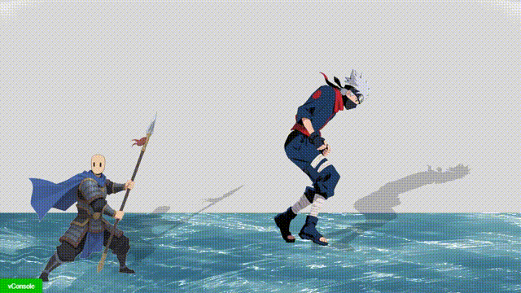

# CocosCreator 2D 游戏光影与水波效果系统

这是一个基于 **Cocos Creator** 的 2D 游戏光影与水波效果系统，可实现精灵物体的动态光影和水面折射效果，支持调整影子斜切、缩放、颜色、偏移及水波的流动参数。

---

## 功能特性

* 🌓 动态生成 2D 精灵影子效果
* 💧 动态水面波动和折射效果
* 🎛️ 可调节影子斜切、缩放、颜色和偏移
* 🎨 支持自定义影子颜色、透明度以及水面流动参数
* ⚡ 基于着色器的轻量级实现
* 📱 支持多种分辨率适配

---

## 作者

**小游码匠** - 微信公众号

[2D游戏角色总飘在空中？一文教你手搓实时影子Shader，角色瞬间落地！](https://mp.weixin.qq.com/s/4nnDDJyHjvhjruGRzgIwug)

---

## 快速开始

### 环境要求

* Cocos Creator 3.x 或更高版本
* 支持 WebGL 的浏览器

### 安装方法

1. 克隆或下载本仓库到本地
2. 使用 Cocos Creator 打开项目文件夹
3. 在场景编辑器中查看示例效果

---

## 精灵影子组件参数

| 参数            | 类型     | 默认值         | 范围          | 说明       |
| ------------- | ------ | ----------- | ----------- | -------- |
| shadowSkew    | Number | 0.5         | [-1.0, 1.0] | X方向斜切程度  |
| shadowScale   | Number | 0.3         | [0.0, 1.0]  | Y方向压扁程度  |
| shadowColor   | Color  | (0,0,0,0.5) | -           | 影子颜色和透明度 |
| shadowXOffset | Number | 0.0         | [-1.0,1.0]  | X轴偏移量    |
| shadowYOffset | Number | 0.0         | [-1.0,1.0]  | Y轴偏移量    |

---

## 水波/折射效果 Uniform 参数

| Uniform 名称         | 类型     | 默认值   | 说明与视觉效果                                        |
| ------------------ | ------ | ----- | ---------------------------------------------- |
| **alphaThreshold** | Number | 0.5   | 控制透明度裁剪（Alpha Test），透明度低于此值的像素会被丢弃，适用于水边缘或透明区域 |
| **u_timeScale**    | Number | 1.0   | 控制水波动画的整体速度，数值越大波动越快，越小水面更静态                   |
| **speed_x**        | Number | -0.5  | 控制水纹在水平方向的流动速度和方向，负数向左，正数向右                    |
| **speed_y**        | Number | 0.1   | 控制水纹在垂直方向的流动速度和方向，正数向下，负数向上                    |
| **emboss**         | Number | 0.02  | 控制水面折射强度，值越大水下图像扭曲越明显，过大会显得不自然                 |
| **intensity**      | Number | 2.4   | 控制单个波的振幅（波峰高度），值越高波纹起伏越大                       |
| **steps**          | Number | 20.0  | 控制参与叠加的波数，波越多水面越复杂逼真，越少则规则单调                   |
| **frequency**      | Number | 20.0  | 控制每个波的周期长度，频率高波更密集，低则更宽                        |
| **angle**          | Number | 90.0  | 决定波形方向数量，方向越多波面越均匀自然                           |
| **delta**          | Number | 20.0  | 控制偏移采样间距，影响折射与反射的细腻程度                          |
| **gain**           | Number | 700.0 | 反射增益，值越大波峰高光越强，水面更闪亮                           |

---

## 性能建议

* 对于移动设备，限制同时显示影子的对象数量
* 静态物体的影子可烘焙为纹理以提高性能
* 使用合理的影子分辨率平衡效果和性能
* 水波效果可适当降低 `steps` 或 `frequency` 来优化性能

---

## 常见问题

* **影子显示不正确或位置偏移**
  检查精灵锚点设置，确保符合预期

* **性能较低**
  减少同时显示影子的对象数量，或降低影子纹理分辨率

* **影子颜色不自然**
  调整影子颜色和透明度参数，使其与场景环境协调

---

## 示例场景

* `main` - 主要演示场景，包含多个可交互精灵对象及水面折射效果

---

## 许可证

MIT 许可证 - 详见 [LICENSE](LICENSE) 文件

---

## 更新日志

### v1.0.0

* 初始版本发布
* 实现基于着色器的光影投射
* 支持斜切、缩放、颜色和偏移参数

### v1.1.0

* 添加水面波动与折射效果
* 支持透明度裁剪、流速、折射强度、波动幅度等参数

---

## 贡献

欢迎提交 Issue 或 Pull Request 改进此项目

---

## 技术支持

* 提交 GitHub Issue
* 关注微信公众号【小游码匠】获取更多技术支持

---

⭐ 如果觉得有帮助，请给本项目一个 Star，也欢迎关注微信公众号获取更多游戏开发资源！

